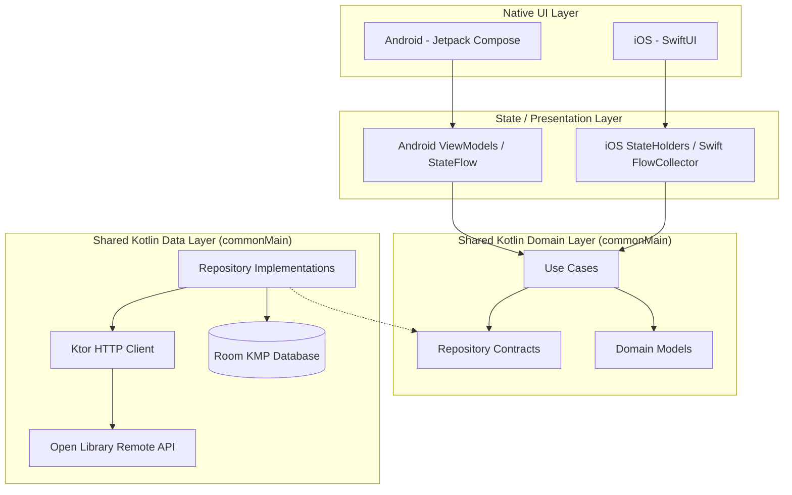

# Shelf — Personal Book Intelligence

> *"Your personal reading space."*

[](https://kotlinlang.org/docs/multiplatform.html)
[](https://developer.android.com/jetpack/compose)
[](https://developer.apple.com/xcode/swiftui/)
[](https://developer.android.com/kotlin/multiplatform/room)
[](https://ktor.io/)
[](https://github.com/imrankhalid001/Shelf)
[](LICENSE)

**Shelf** is a premium, modern, offline-first personal book intelligence application built with **Kotlin Multiplatform (KMP)**.

Shelf unifies core business logic, Room KMP database storage, Ktor network synchronization, and reading analytics across platforms in a shared Kotlin codebase (`commonMain`), while delivering **100% native UI/UX implementations** on **Android** (Jetpack Compose) and **iOS** (SwiftUI).

---

## 🎥 App Demo Video

Watch the complete **Shelf** cross-platform application in action on YouTube:

[](https://youtu.be/DbnmzMwh9SY)

> 🎬 **YouTube Demo Link**: [https://youtu.be/DbnmzMwh9SY](https://youtu.be/DbnmzMwh9SY)

---

## ✨ Features & Parity (Android + iOS)

- 🏠 **Personal Dashboard**: Welcome greeting header, live daily streak badge (`🔥 Days`), active *Continue Reading* card with page progress slider, *Recommended for You* carousel, *Saved in Your Library* carousel, and quick reading metrics.
- 🔍 **Book Discovery & Search**: Query millions of books and authors via the public Open Library API with debounced input and offline cache fallback.
- 📖 **Free Open Library Reader Integration**: Direct link button ("Read Free on Open Library 📖") opening official work reader pages.
- 📚 **Personal Library Management**: Organize books across reading statuses (`Want to Read`, `Reading`, `Finished`, `Paused`, `Dropped`).
- 🔖 **Custom Shelves & Collections**: Create and organize custom book collections (e.g., *Productivity*, *Fiction*, *2026 Tech Stack*) with creation dialogs/sheets.
- 📊 **Reading Intelligence Dashboard**: Live reading streak counter, 2x2 velocity grid (*Pages Read*, *Reading Time*, *Books Completed*, *Pace p/hr*), 2026 Reading Goal Target progress card with `-5` and `+5` goal adjust controls, and monthly activity distribution bar chart.
- 🎨 **Unified App Icon & Animated Splash Screen**: Matching custom vector branding (`ic_shelf_logo` / `AppIcon`) and animated launch screens on both platforms.
- ✈️ **100% Offline-First Architecture**: Single source of truth powered by Room KMP SQLite persistence and reactive Kotlin Coroutine `Flow` streams.

---

## 🏛️ Architecture Overview

Shelf follows **Clean Architecture** and the **Repository Pattern**.



---

## 🛠️ Tech Stack

### Shared KMP Module (`shared`)
- **Language**: Kotlin 2.1+
- **Database**: Room KMP (SQLite cross-platform local persistence)
- **Networking**: Ktor Client 3.x
- **Serialization**: `kotlinx.serialization`
- **Concurrency**: Kotlin Coroutines & `Flow`
- **DateTime**: `kotlinx-datetime`
- **Testing**: `kotlin.test`, `kotlinx-coroutines-test` (25/25 tests passing)

### Android Application (`app`)
- **UI Framework**: Jetpack Compose (Material 3)
- **Architecture**: `androidx.lifecycle.ViewModel` + `StateFlow`
- **Navigation**: Jetpack Compose Navigation
- **Splash Screen**: `androidx.core:core-splashscreen`

### iOS Application (`iosApp`)
- **UI Framework**: SwiftUI (iOS 17+)
- **Architecture**: Swift StateHolders bridging KMP Flow streams via `SwiftFlowCollector`
- **Navigation**: `NavigationStack` & `TabView`
- **App Icon & Assets**: Native Xcode Asset Catalog (`AppIcon.appiconset`) & custom animated `SplashView`

---

## 📂 Project Structure

```
Shelf/
├── app/                       # Android App (Jetpack Compose UI)
├── iosApp/                    # iOS App (SwiftUI UI)
│   └── iosApp/
│       ├── Assets.xcassets/   # iOS AppIcon & Asset Catalog
│       ├── KMPBridge.swift    # Swift KMP Dependency Injection & FlowCollector
│       └── UI/                # Native SwiftUI Views, Components & Splash Screen
├── shared/                    # KMP Shared Module
│   └── src/
│       ├── commonMain/        # Shared Domain, Data, Core & Room Database
│       ├── androidMain/       # Android SQLite Drivers
│       └── iosMain/           # iOS SQLite Drivers
└── README.md                  # Project Overview
```

---

## 🚀 Getting Started

### Prerequisites
- **JDK 17+**
- **Android Studio** (2024.1+)
- **Xcode 15+** (macOS required for iOS builds)

### Building & Running

1. Clone the repository:
   ```bash
   git clone https://github.com/imrankhalid001/Shelf.git
   cd Shelf
   ```

2. Run Shared Unit Tests:
   ```bash
   ./gradlew test
   ```

3. Run Android App:
   Execute `./gradlew assembleDebug` or run `:app` from Android Studio.

4. Run iOS App:
   Open `iosApp/iosApp.xcodeproj` in Xcode and press **Cmd + R** (or select any Apple Silicon Simulator / connected iPhone).

---

## 📄 License

This project is licensed under the MIT License — see the [LICENSE](LICENSE) file for details.
