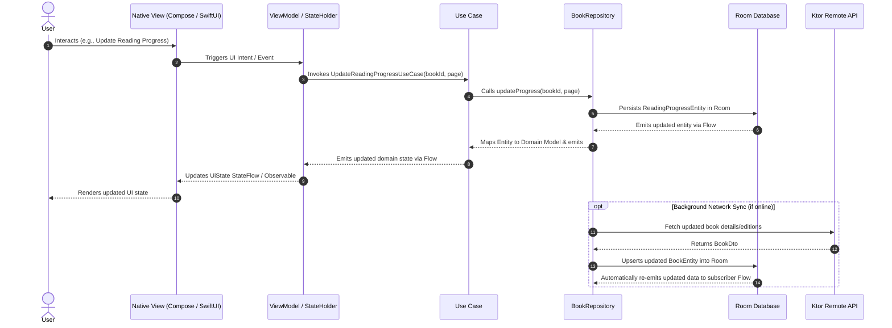

# ARCHITECTURE.md — Shelf System & KMP Architecture

## 1. Executive Architecture Summary

**Shelf** strictly separates **Shared Business Logic** from **Native UI Presentation**.

- **Shared Domain, Data, & Core Layers**: Implemented in Kotlin Multiplatform (`shared/src/commonMain`).
- **Android UI Layer**: Implemented in Kotlin with **Jetpack Compose** (`app/src/main/`).
- **iOS UI Layer**: Implemented in Swift with **SwiftUI** (`iosApp/iosApp/`).

---

## 2. Layer Diagram & Dependency Rules

```
+-----------------------------------------------------------------------+
|                         NATIVE PRESENTATION                           |
|  Android (Jetpack Compose + ViewModel)   iOS (SwiftUI + Observable)  |
+-----------------------------------------------------------------------+
                                  |
                                  v
+-----------------------------------------------------------------------+
|                    SHARED DOMAIN LAYER (commonMain)                   |
|  Use Cases  |  Domain Models  |  Repository Contracts  |  Value Objects |
+-----------------------------------------------------------------------+
                                  ^
                                  |
+-----------------------------------------------------------------------+
|                     SHARED DATA LAYER (commonMain)                    |
|  Repository Impls | Room DAOs & Entities | Ktor API Client & DTOs | Mappers |
+-----------------------------------------------------------------------+
                                  |
                                  v
+-----------------------------------------------------------------------+
|                     SHARED CORE LAYER (commonMain)                    |
|  AppResult  |  AppError  |  Logger  |  DispatcherProvider  |  DateUtils|
+-----------------------------------------------------------------------+
```

### Dependency Rules:
1. **Presentation Layer** depends ONLY on **Domain Layer** (and Core utilities). It NEVER depends on Data layer implementations, DTOs, or Entities.
2. **Domain Layer** has ZERO external framework dependencies. It relies exclusively on pure Kotlin standard library, Coroutines, and Flow.
3. **Data Layer** implements Domain Repository contracts, translates DTOs and Entities into Domain Models via explicit Mappers, and manages data flow.

---

## 3. Data Flow Architecture

Shelf enforces unidirectional data flow (UDF) backed by an offline-first Room database.



---

## 4. Shared KMP vs Native UI Boundaries

| Layer / Component | Shared in KMP (`shared`) | Android Native (`app`) | iOS Native (`iosApp`) |
| ----------------- | :----------------------: | :--------------------: | :-------------------: |
| **Domain Models** | :white_check_mark: Kotlin | — | — |
| **Use Cases** | :white_check_mark: Kotlin | — | — |
| **Repository Contracts** | :white_check_mark: Kotlin | — | — |
| **Repository Impls** | :white_check_mark: Kotlin | — | — |
| **Room Entities & DAOs** | :white_check_mark: Room KMP | — | — |
| **Network Client & DTOs** | :white_check_mark: Ktor Client | — | — |
| **State Mapping Logic** | :white_check_mark: Kotlin | — | — |
| **Date & String Utils** | :white_check_mark: Kotlin | — | — |
| **Unit Tests** | :white_check_mark: commonTest | — | — |
| **UI Screen Views** | :x: | :white_check_mark: Jetpack Compose | :white_check_mark: SwiftUI |
| **UI Components/Cards** | :x: | :white_check_mark: Jetpack Compose | :white_check_mark: SwiftUI |
| **Navigation Flows** | :x: | :white_check_mark: Compose Nav | :white_check_mark: NavigationStack |
| **ViewModels / Holders** | :x: | :white_check_mark: Android ViewModel | :white_check_mark: Swift Observable |
